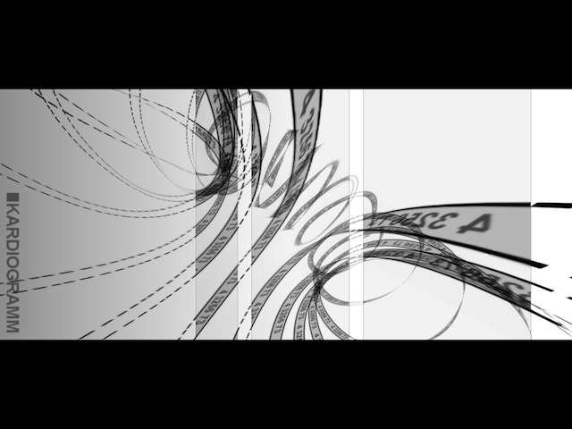
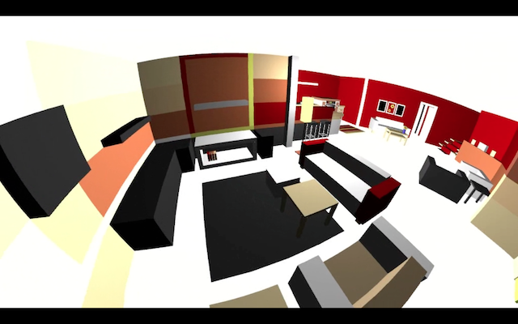
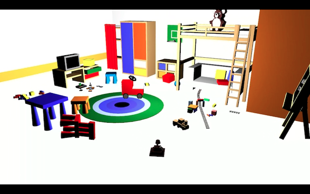
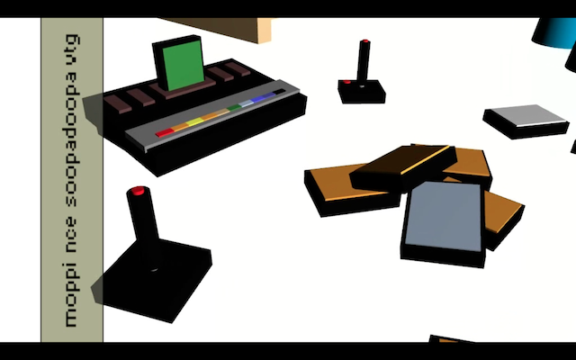
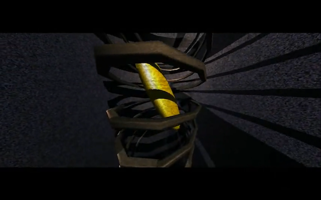
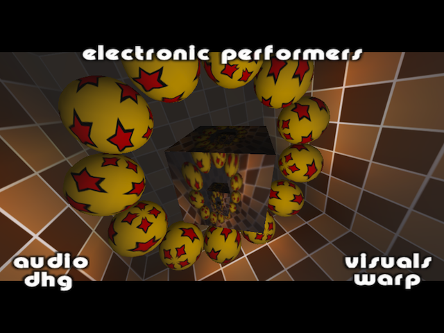
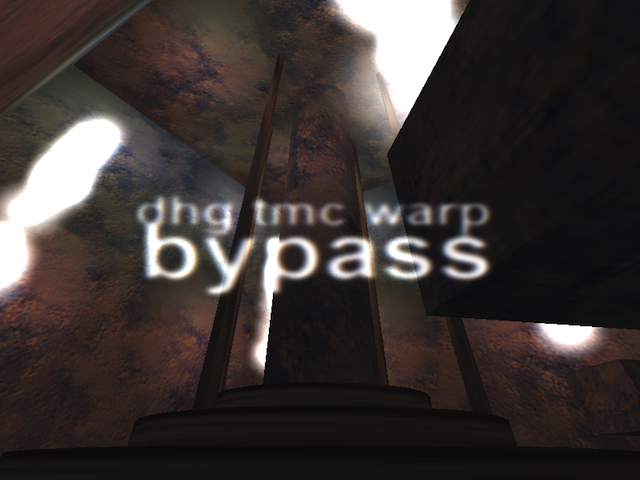
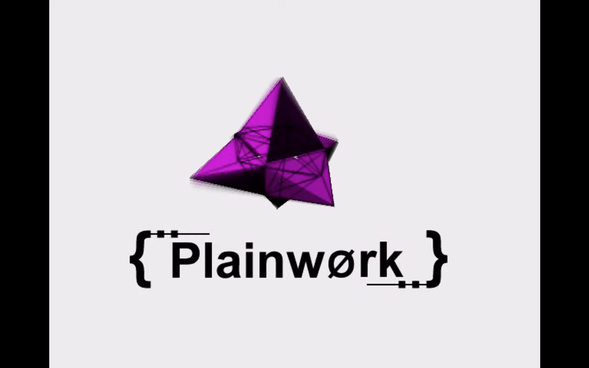

# Selected works by unik and friends

## luminosity

A 64kb intro released at Deadline 2024. Place 4th.

- [Pouet](https://www.pouet.net/prod.php?which=98327)
- [Online](https://unik.de/online/luminosity)
- [Binaries](https://unik.de/download/bypass-luminosity.zip)
- [YouTube](soon)
- [Source](soon)

---

## elusive

A 4kb intro released at Deadline 2023. Place 6th in the combined intro competition.

- [Pouet](https://www.pouet.net/prod.php?which=95237)
- [Online](https://unik.de/online/elusive)
- [Binaries](https://unik.de/download/bypass-elusive.zip)
- [YouTube](https://youtu.be/Ic4mNuHYiN8)
- [Source](https://github.com/mgnauck/elusive/)

---

## Mac My Bitch Up

A demo released at Evoke 2006. Placed 3rd.

- [Pouet](https://www.pouet.net/prod.php?which=25863)
- [YouTube](https://www.youtube.com/watch?v=u9Dnidi7b2Y)
- [macOS binaries](https://files.scene.org/view/demos/groups/unik/bps-macmybitchup.dmg)
- [Windows binaries](https://files.scene.org/view/demos/groups/unik/bps-macmybitchup.zip)
- [Source](https://github.com/mgnauck/mac-my-bitch-up)

---

## be your own pet

A 64kb intro released at Breakpoint 2006. Placed 6th.

- [Pouet](https://www.pouet.net/prod.php?which=24492)
- [YouTube](https://www.youtube.com/watch?v=qy2na0HiSeU)
- [Windows binaries](https://files.scene.org/view/parties/2006/breakpoint06/in64/beyourownpet.zip)
- [macOS binaries](https://files.scene.org/view/demos/groups/unik/bps-beyourownpet.dmg)
- [Source](https://github.com/mgnauck/be-your-own-pet)

---

## kurz&knackig

A 4kb intro released at Evoke 2005. Placed 3rd.

- [Pouet](https://www.pouet.net/prod.php?which=18755)
- [YouTube](https://www.youtube.com/watch?v=Y09mzeJyqGI)
- [Windows binaries](https://files.scene.org/view/parties/2005/evoke05/in4k/kurz_knackig_final.zip)
- [Source](https://github.com/mgnauck/kurz-und-knackig)

---

## Kardiogramm

A 64kb intro released at Breakpoint 2005. Placed 5th.

- [Pouet](https://www.pouet.net/prod.php?which=16347)
- [YouTube](http://www.youtube.com/watch?v=K5Nd77s98m4)
- [Windows binaries](https://files.scene.org/view/demos/groups/unik/kardiogramm.zip)
- [macOS binaries](https://files.scene.org/view/demos/groups/unik/kardiogrammosx.zip)
- [Soundtrack](https://files.scene.org/view/music/artists/marek/kardiogramm.zip)

---

## Anruf aus Schweden

A 64kb intro released at Evoke 2004. Placed 1st.

- [Pouet](https://www.pouet.net/prod.php?which=13621)
- [YouTube](https://www.youtube.com/watch?v=tKoB1CchJFU)
- [Windows binaries](https://files.scene.org/view/demos/groups/unik/anruf.zip)
- [Linux binaries](https://files.scene.org/view/demos/groups/unik/anruf_linux.tar)
- [Source](https://github.com/mgnauck/anruf-aus-schweden)

---

## Subversive

A 64kb intro released at Breakpoint 2003. Placed 3rd.

- [Pouet](https://www.pouet.net/prod.php?which=9443)
- [YouTube](https://www.youtube.com/watch?v=2JN82TUCeys)
- [Windows binaries](https://files.scene.org/view/parties/2003/breakpoint03/in64/subversive.zip)

---

## Blusher

A 64kb intro released at Geekcamp 2002. Placed 1st in the combined demo/intro competition.

- [Pouet](https://www.pouet.net/prod.php?which=7840)
- [YouTube](http://www.youtube.com/watch?v=UoOln2gl6hM)
- [Windows binaries](https://files.scene.org/view/demos/groups/unik/blusher_final.zip)
- [Soundtrack](ftp://ftp.scene.org/pub/music/artists/marek/marekaneel-blusher.ogg)

---

## Intense Pattern

A demo released at Mekka & Symposium 2002. Placed 7th.

- [Pouet](https://www.pouet.net/prod.php?which=5587)
- [YouTube](https://www.youtube.com/watch?v=w_w2Qu8bCYc)
- [Windows binaries](https://files.scene.org/view/demos/groups/unik/intense_pattern.zip)

---

## Discoranger

A 64kb intro released at Dialogos 2001. Placed 1st.

- [Pouet](https://www.pouet.net/prod.php?which=4134)
- [YouTube](https://youtu.be/7q2VZ6A2AoE)
- [Windows binaries (party)](https://files.scene.org/view/demos/groups/unik/disco_party.zip)
- [Windows binaries (final)](https://files.scene.org/view/demos/groups/unik/disco_final.zip)
- [Source](https://github.com/mgnauck/discoranger)

---

## shrooms

A 64kb intro released at Takeover 2001. Placed 1st.

- [Pouet](https://www.pouet.net/prod.php?which=2908)
- [YouTube](https://www.youtube.com/watch?v=k2lbRBxZXF8)
- [Windows binaries](https://files.scene.org/view/demos/groups/unik/shrooms_party.zip)

---

## Lovemachine

A 64kb intro released at Dialogos 2000. Placed 2nd.

- [Pouet](https://www.pouet.net/prod.php?which=761)
- [YouTube](https://youtu.be/LmUn5tCUAiA)
- [Windows binaries](https://files.scene.org/view/demos/groups/unik/love.zip)

---

## Defrost

A 64kb intro released at Evoke 2000. Placed 2nd.

- [Pouet](https://www.pouet.net/prod.php?which=241)
- [YouTube](https://youtu.be/ipUabPuqMeE)
- [Windows binaries (party)](https://files.scene.org/view/demos/groups/unik/defrost.zip)
- [Windows binaries (final)](https://files.scene.org/view/demos/groups/unik/defrost_f.zip)

---

## Pluxity

A 64kb intro released at Takeover 2000. Placed 1st.

- [Pouet](https://www.pouet.net/prod.php?which=169)
- [YouTube](https://www.youtube.com/watch?v=ME6QsEc2twI)
- [Windows binaries](https://files.scene.org/view/demos/groups/unik/pluxity_final.zip)

---

## Plainwork

A 64kb intro released at Mekka & Symposium 2000. Placed 8th.

- [Pouet](https://www.pouet.net/prod.php?which=168)
- [YouTube](https://www.youtube.com/watch?v=TjeeotLlUwk)
- [Windows binaries](https://files.scene.org/view/demos/groups/unik/plain_final.zip)

---

Heavily involved in some of these productions were our friends from [Bypass](https://www.pouet.net/groups.php?which=387), [Black Maiden](https://www.blackmaiden.de) and [kolor](http://www.kolor.org).
<3
